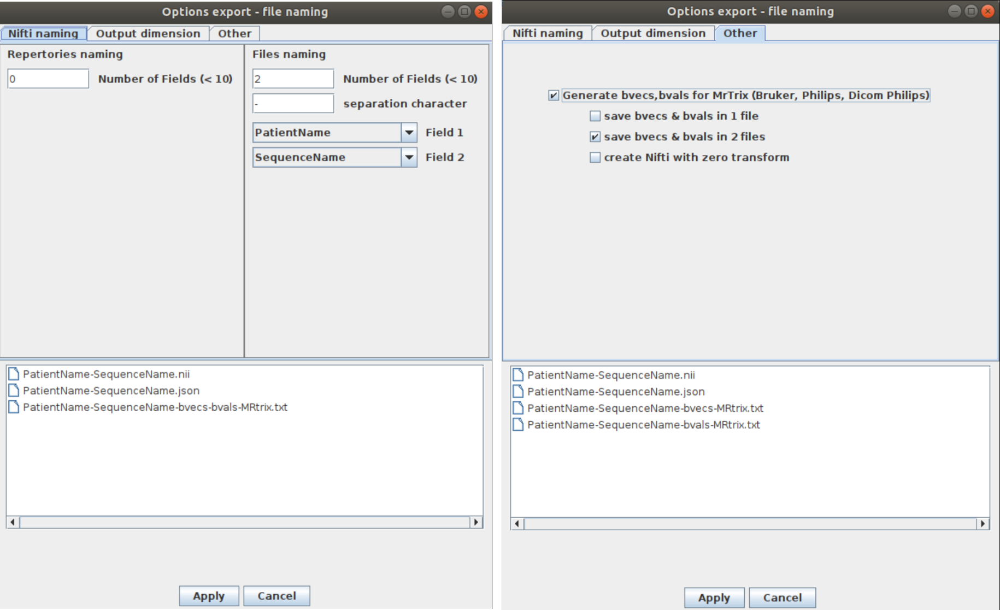

# MRI_param_maps_extraction
Pipeline to extract the MRI multiparametric maps corresponding to the InnobioPark project of Grenoble Institute of Neuroscience

## Pre-requisites : 
Install mri_conv for dicom to nifti conversion at : https://populse.github.io/mri_conv/Installation/installation.html
Install MRtrix3.0 for DTI tensor map calculation at : https://www.mrtrix.org/
Install spm12

## Data 
In order to perform DICOM to NIfTI conversion we recommend to used mri_conv.
Before starting be sure to choose the correct export options : 
```
File --> export --> Option export
The filenames should be composed by the subject name + the sequence name.
It's important to extract bvals and bvecs files as well.
```


Then, click on Dicom and choose the folder where your files are kept.
All Dicom repositories will be available, select subject by subject the images you want to convert to nifti.
For SignaPark, choose all but the perfusion indexes (nINDEXPERFUSION, nTTPPERFUSION, nMTTPERFUSION, nNIPERFUSION) and the pCASL source signal. 
Once selected, right click and [Add to basket] (ctrl+b)
[!!! DO NOT overwrite DCE-FA35 !!!]
From the basket, you can choose the folder where the data will be exported.

## Code
The code was written on MATLAB version 2018b

### Organization
Log files and unnecessary bvals and bvecs files are deleted.
Every subject has a folder organized as followed:
```
SUBJECT
	*Anat
	*Diffusion
	*Perfusion	
	*Relaxometry
```
### Parameter extraction
#### Perfusion: 
The pCASL image can already be used as a CBF map.
The PERFUSION image correspond to the acquisitions that follow a Gadolinium bolus. Using the script provided the following maps can be extracted: 'CBV', 'CBF', 'MTT', 'TMAX', 'TTP', 'T0'

#### Diffusion:
Using MRtrix we can extract 2 diffusion tensor parameters : FA and MD

#### Relaxometry:
It is possible to extract a T1 map using the variable flip angle images acquired under the name DCE-FA#.
A multiple echo methodology is used to extract a T2 star map.

### What to do next
Once the maps are calculated, you can perfom a segmentation of the anatomical image using spm12 in order to register the image to a certain space or an atlas to the image.
It can also be useful to coregister all of the parametric maps to the anatomical image, to do this use the code provided.
